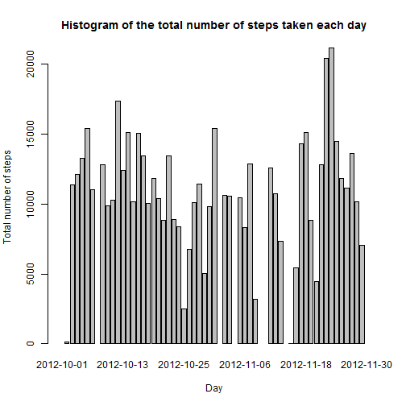
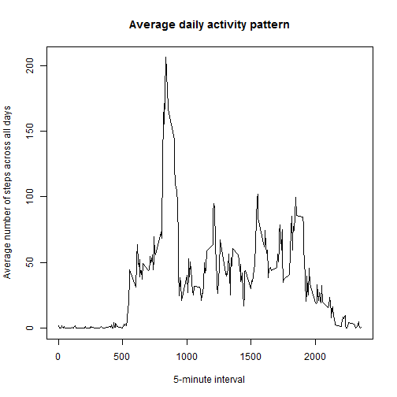
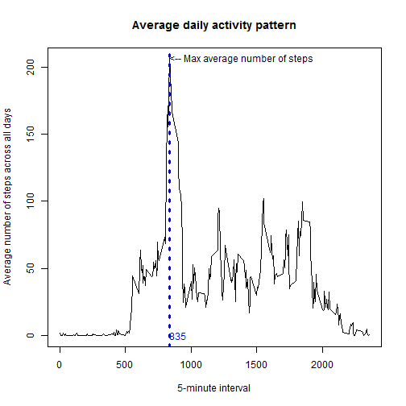
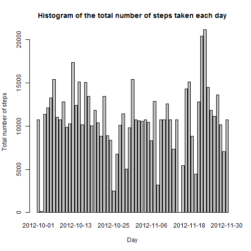
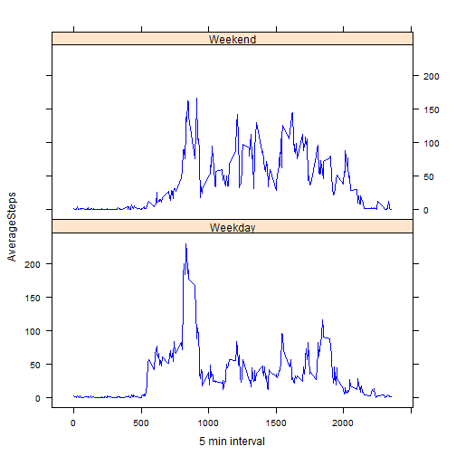

```r
library(dplyr)
```
-----------------------------------------------

# Loading and preprocessing the data
====================================

## 1. Loading the data (date variable type converted to Date )


```r
download.file("https://d396qusza40orc.cloudfront.net/repdata%2Fdata%2Factivity.zip",destfile = "./data.zip")
unzip(zipfile="./data.zip",exdir = ".")
Activity<-read.csv("./activity.csv")
```

## 2. Process/transform the data

```r
Activity$date<-as.Date(Activity$date,format="%Y-%m-%d")
str(Activity)
```

```
## 'data.frame':	17568 obs. of  3 variables:
##  $ steps   : int  NA NA NA NA NA NA NA NA NA NA ...
##  $ date    : Date, format: "2012-10-01" "2012-10-01" ...
##  $ interval: int  0 5 10 15 20 25 30 35 40 45 ...
```
-----------------------------------------------

# What is mean total number of steps taken per day?
===================================================

## 1. Calculate the total number of steps taken per day

```r
totalSteps<-aggregate(Activity$steps, by=list(Activity$date) , FUN = sum)
names(totalSteps)<-c("dates","totalSteps")
head(totalSteps)
```

```
##        dates totalSteps
## 1 2012-10-01         NA
## 2 2012-10-02        126
## 3 2012-10-03      11352
## 4 2012-10-04      12116
## 5 2012-10-05      13294
## 6 2012-10-06      15420
```

## 2.Make a histogram of the total number of steps taken each day

```r
barplot(totalSteps$totalSteps,xlab = "Day", main = "Histogram of the total number of steps taken each day", ylab = "Total number of steps",names.arg = as.array(totalSteps$dates))
```



## 3.Calculate and report the mean and median of the total number of steps taken per day

```r
summary(totalSteps)
```

```
##      dates              totalSteps   
##  Min.   :2012-10-01   Min.   :   41  
##  1st Qu.:2012-10-16   1st Qu.: 8841  
##  Median :2012-10-31   Median :10765  
##  Mean   :2012-10-31   Mean   :10766  
##  3rd Qu.:2012-11-15   3rd Qu.:13294  
##  Max.   :2012-11-30   Max.   :21194  
##                       NA's   :8
```

# What is the average daily activity pattern?
=============================================

## 1. Make a time series plot of the 5-minute interval (x-axis) and the average number of steps taken, averaged across all days (y-axis)

```r
DailyPattern<-aggregate(subset(Activity,!is.na(Activity$steps)==TRUE)$steps, by=list(subset(Activity,!is.na(Activity$steps)==TRUE)$interval) , FUN = mean)
names(DailyPattern)<-c("5 min interval","AverageSteps")
plot(DailyPattern$`5 min interval`,DailyPattern$AverageSteps,type="l",main = "Average daily activity pattern",xlab = "5-minute interval",ylab = "Average number of steps across all days")
```



# 2. Which 5-minute interval, on average across all the days in the dataset, contains the maximum number of steps?

```r
MaxIndex<-which.max(DailyPattern$AverageSteps)
plot(DailyPattern$`5 min interval`,DailyPattern$AverageSteps,type="l",main = "Average daily activity pattern",xlab = "5-minute interval",ylab = "Average number of steps across all days")
abline(v=DailyPattern$`5 min interval`[MaxIndex],lty=3,lwd=3,col="blue")
text(DailyPattern$`5 min interval`[MaxIndex], DailyPattern$AverageSteps [MaxIndex], "<-- Max average number of steps ", adj = 0)
text(DailyPattern$`5 min interval`[MaxIndex], 0 , DailyPattern$`5 min interval`[MaxIndex], adj = 0, lty=3,lwd=3,col="blue")
```



# Imputing missing values
=========================

## 1. total number of missing values in the dataset 

```r
paste("Total number of missing values in the dataset is:",sum(!complete.cases(Activity)))
```

```
## [1] "Total number of missing values in the dataset is: 2304"
```

## 2. Strategy for filling in all of the missing values in the dataset

```r
ActvityAvgAdded<-merge(Activity,DailyPattern,by.x = "interval",by.y = "5 min interval")
NAIndex<-which(is.na(ActvityAvgAdded$steps)==TRUE)
ActvityAvgAdded$steps[NAIndex]<-ActvityAvgAdded$AverageSteps[NAIndex]
```

## 3. Create a new dataset that is equal to the original dataset but with the missing data filled in

```r
ActivityNew<-select(ActvityAvgAdded,steps,date,interval)
ActivityNew<-arrange(ActivityNew,date,interval)
head(ActivityNew)
```

```
##       steps       date interval
## 1 1.7169811 2012-10-01        0
## 2 0.3396226 2012-10-01        5
## 3 0.1320755 2012-10-01       10
## 4 0.1509434 2012-10-01       15
## 5 0.0754717 2012-10-01       20
## 6 2.0943396 2012-10-01       25
```

## 4. Make a histogram of the total number of steps taken each day and Calculate and report the mean and median total number of steps taken per day

```r
totalStepsNew<-aggregate(ActivityNew$steps, by=list(ActivityNew$date) , FUN = sum)
names(totalStepsNew)<-c("dates","totalSteps")
barplot(totalStepsNew$totalSteps,xlab = "Day", main = "Histogram of the total number of steps taken each day", ylab = "Total number of steps",names.arg = as.array(totalStepsNew$dates))
```



```r
summary(totalStepsNew)
```

```
##      dates              totalSteps   
##  Min.   :2012-10-01   Min.   :   41  
##  1st Qu.:2012-10-16   1st Qu.: 9819  
##  Median :2012-10-31   Median :10766  
##  Mean   :2012-10-31   Mean   :10766  
##  3rd Qu.:2012-11-15   3rd Qu.:12811  
##  Max.   :2012-11-30   Max.   :21194
```

# Are there differences in activity patterns between weekdays and weekends?
==================================================================

## 1.Create a new factor variable in the dataset with two levels – “weekday” and “weekend” indicating whether a given date is a weekday or weekend day.

```r
WeekMap<-matrix(c("Monday" , "Tuesday" , "Wednesday" , "Thursday" , "Friday" , "Saturday" , "Sunday" , "Weekday" ,"Weekday" ,"Weekday" ,"Weekday" ,"Weekday" , "Weekend"  , "Weekend"),nrow = 7,ncol = 2)
WeekMap<-as.data.frame(WeekMap)
names(WeekMap)<-c("Day","DayCat")
ActivityNew<-mutate(ActivityNew,Day = weekdays(date))
ActivityNew<-merge(ActivityNew,WeekMap,by.x = "Day", by.y = "Day")
ActivityNew<-arrange(ActivityNew,date,interval)
ActivityNew<-ActivityNew[,c(2,3,4,1,5)]
head(ActivityNew)
```

```
##       steps       date interval    Day  DayCat
## 1 1.7169811 2012-10-01        0 Monday Weekday
## 2 0.3396226 2012-10-01        5 Monday Weekday
## 3 0.1320755 2012-10-01       10 Monday Weekday
## 4 0.1509434 2012-10-01       15 Monday Weekday
## 5 0.0754717 2012-10-01       20 Monday Weekday
## 6 2.0943396 2012-10-01       25 Monday Weekday
```

## 2.Make a panel plot containing a time series plot  of the 5-minute interval (x-axis) and the average number of steps taken, averaged across all weekday days or weekend days (y-axis)


```r
DailyPatternNew<-aggregate(ActivityNew$steps,by = list(ActivityNew$interval,ActivityNew$DayCat),FUN=mean)
names(DailyPatternNew)<-c("5 min interval","DayCat","AverageSteps")
library(lattice)
xyplot(AverageSteps~`5 min interval`|DayCat,data = DailyPatternNew,layout=c(1, 2),type="l",col = "blue")
```


